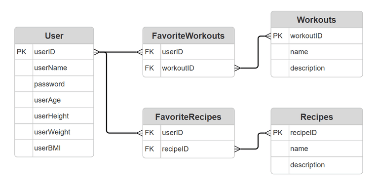

# Fitness Tracking API - ASP.NET Core Backend

This is the backend REST API for the **Fitness Tracking** web application. Built using **ASP.NET Core**, this service handles user registration, login, workout and recipe management, and favorite tracking features. It connects to a SQL Server database and is designed to work seamlessly with the front-end part of the project.

---

## Tech Stack

- **ASP.NET Core 7+**
- **Entity Framework Core**
- **SQL Server (LocalDB or full SQL Express)**
- **Swagger / OpenAPI**
- **CORS Enabled** (for frontend/backend communication)

---

## Project Structure Overview

- `Program.cs` – Main entry point and service configuration
- `Data/` – EF Core context, models, DTOs, seeds, and mappers
- `Controllers/` – Main controller for users and favorites
- `Seed/WorkoutsRecipesSeed.cs` – Preloads workouts and recipes into the DB
- `AppDbContext.cs` – Database context for EF Core

---

## Available API Endpoints

### User Operations

| Method | Route                        | Description       |
| ------ | ---------------------------- | ----------------- |
| GET    | `/api/user/GetUsers`         | Get all users     |
| GET    | `/api/user/GetUserById/{id}` | Get user by ID    |
| POST   | `/api/user/CreateUser`       | Create a new user |
| PUT    | `/api/user/UpdateUser/{id}`  | Update user info  |
| DELETE | `/api/user/DeleteUser/{id}`  | Delete a user     |
| POST   | `/api/user/Login`            | User login        |

### Favorite Workouts

| Method | Route                                | Description                       |
| ------ | ------------------------------------ | --------------------------------- |
| POST   | `/api/user/AddFavoriteWorkout`       | Add a workout to user's favorites |
| GET    | `/api/user/GetFavoriteWorkouts/{id}` | Get user's favorite workouts      |
| DELETE | `/api/user/RemoveFavoriteWorkout`    | Remove workout from favorites     |

### Favorite Recipes

| Method | Route                               | Description                      |
| ------ | ----------------------------------- | -------------------------------- |
| POST   | `/api/user/AddFavoriteRecipe`       | Add a recipe to user's favorites |
| GET    | `/api/user/GetFavoriteRecipes/{id}` | Get user's favorite recipes      |
| DELETE | `/api/user/RemoveFavoriteRecipe`    | Remove recipe from favorites     |

---

## How to Run Locally

1. **Clone the repo**

   ```bash
   git clone https://github.com/MarkoPapathimiu/ProzhektAPI.git
   cd ProzhektAPI
   ```

2. **Restore NuGet packages**

   ```bash
   dotnet restore
   ```

3. **Restore database**

   - Open _Package Manager Console_ in Visual Studio (Tools > NuGet Package Manager > Package Manager Console)
   - Then run:

   ```
     Update-Database
   ```

4. **Build and run the app**

   ```bash
   dotnet build
   dotnet run
   ```

5. **Navigate to Swagger UI**

   ```
   (For Testing)
   https://localhost:5001/swagger
   > If this URL doesn't work, check your terminal for the exact port the server is listening on.
   ```

---

## Related Repositories

- **Backend:** [ProzhektAPI](https://github.com/MarkoPapathimiu/ProzhektAPI)

---

## CORS Support

CORS is configured in `Program.cs`:

```csharp
builder.Services.AddCors(options =>
{
    options.AddPolicy("AllowAll", policy =>
    {
        policy.AllowAnyOrigin()
              .AllowAnyHeader()
              .AllowAnyMethod();
    });
});
```

---

## Database & Seeding

The app seeds **12 workouts** and **24 recipes** into the SQL Server database on first run.

Make sure your connection string is correct for local SQL Server:

```csharp
Server=localhost\SQLEXPRESS;Database=FitnessTrackingDb;Trusted_Connection=True;
```

---

## Database Structure

The database is structured around a **user-centric fitness tracking system**, supporting core features like managing workouts, recipes, and favorites.

### Entity Relationship Diagram



### Tables Overview

- **User**: Stores user profile information including basic stats like height, weight, and BMI.
- **Workouts**: Contains predefined workouts with names and descriptions.
- **Recipes**: Stores healthy recipes with names and descriptions.
- **FavoriteWorkouts**: Many-to-many bridge table linking users to their favorite workouts.
- **FavoriteRecipes**: Many-to-many bridge table linking users to their favorite recipes.

### Relationships

- A **user** can have **many favorite workouts** and **many favorite recipes**.
- Each **favorite** is a relationship between the `User` table and either `Workouts` or `Recipes` via a junction table.
- All foreign keys enforce referential integrity to ensure users and their favorites are consistently managed.

---

## License

FSHN © 2025 Prozhekt Team
